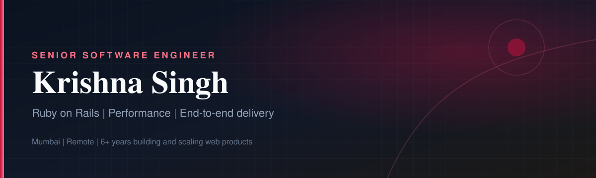

  

 

### About me

I build and scale **Ruby on Rails** products with a bias for clarity, speed, and ownership.

Over **6+ years**, I’ve shipped features end-to-end, tuned slow queries under load, debugged production incidents, and partnered across product, design, and support. Currently a **Senior Software Engineer at Procore**, working on BIM collaboration workflows.

Previously helped scale **Lawlytics to 100,000+ daily visits**, led a team of 5 at TagNTrack, and contributed upstream to the Rails ecosystem. Writing featured in **Ruby Weekly**.

### What I bring

<table>
  <tr>
    <td width="33%" valign="top">
      <h3>Ship end-to-end</h3>
      
Own features from design and architecture through rollout—APIs, data model, tests, and release.

    </td>
    <td width="33%" valign="top">
      <h3>Make it fast</h3>
      
Query optimization, API latency work, and pragmatic caching so products stay snappy at scale.

    </td>
    <td width="33%" valign="top">
      <h3>Keep prod calm</h3>
      
Customer issues, production debug, and durable fixes—then harden the path so it doesn’t return.

    </td>
  </tr>
</table>

### Tech I work with

  
  
  
  
  
  
  
  
  

### Snapshot

  
  

### Selected work

| Role | Impact |
|---|---|
| **Procore Technologies** · SSE | BCF / BIM workflows end-to-end · high-load API & query performance · cross-team delivery |
| **TagNTrack** · SSE | Led 5 engineers · REST APIs · coverage & reliability · query/path optimization |
| **Lawlytics** · SSE | Scaled to **100k+ daily visits** · DNS automation (~10 hrs/client) · production firefighting |
| **[Resume repo](https://github.com/krishnasingh001/krishna-singh-resume)** | Full career write-up and highlights |

### Open source & writing

- Contributor to **Ruby on Rails** and the broader Ruby ecosystem  
- Deep-dives on 2FA, race conditions, `#load_async`, Turbo/Hotwire, and Rails 7 ActiveRecord  
- Featured in **[Ruby Weekly](https://rubyweekly.com)** for Rails 7 controller performance with `#load_async`

### Let’s connect

I’m open to conversations about Rails architecture, performance, and product engineering leadership.

[krishnasingh.me](https://krishnasingh.me) · [Resume](https://github.com/krishnasingh001/krishna-singh-resume) · [LinkedIn](https://www.linkedin.com/in/krishnasingh) · [krishnasinghcs@gmail.com](mailto:krishnasinghcs@gmail.com)

 

